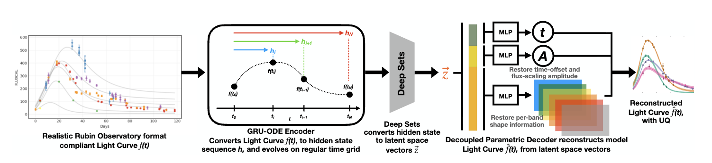

# SELDON: Supernova Explosions Learned by Deep ODE Networks



Welcome! This is the code companion to **“SELDON: Supernova Explosions Learned by Deep ODE Networks”** (Jiezhong Wu, Jack O’Brien, Jennifer Li, M. S. Krafczyk, Ved G. Shah, Amanda R. Wasserman, Daniel W. Apley, Gautham Narayan, Noelle I. Samia; to appear at AAAI 2026). We’re excited for you to explore the model—check out the architecture above, then dive into the code. SELDON blends neural ODE encoders with a band-aware decoder to reconstruct, interpolate, and forecast multi-band flux from irregular observations. Everything is Hydra-driven, with ready-to-run data loaders, models, experiments, and analysis scripts—jump in and try it!

## Features
- Neural ODE encoder for irregular, multi-band light-curve sequences with variational latent space.
- Band-aware Gaussian basis decoder for reconstruction, interpolation, and forecasting.
- Hydra-driven configuration of datasets, models, experiments, and trainer settings.
- PyTorch Lightning training with checkpointing and TensorBoard logging.
- Data loaders for pickle/parquet supernova light curves with augmentation, masking, and normalization.
- Utility scripts to load checkpoints, generate embeddings/reconstructions, and batch forecasting outputs.

## Installation
Environment uses Python 3.9, PyTorch 2.7.1, Lightning 2.5, and torchode. Create the conda env from the repo:

```bash
conda env create -f TAE/environment.yaml
conda activate tae
```

If you prefer pip inside the env (after activating):

```bash
pip install -r TAE/requirements.txt
pip install git+https://github.com/martenlienen/torchode
```

## Quickstart
### Train
Run training via Hydra. Override the dataset path and any trainer settings you need:

```bash
python train.py \
  --config-name SELDON_1.0 \
  dataset.config.lightcurve_path=/path/to/cleaned_data.pkl \
  logging_params.save_dir=./logs \
  logging_params.name=SELDON_run \
  trainer_params.devices=1 \
  trainer_params.strategy=ddp
```

This writes TensorBoard logs and checkpoints under `./logs/SELDON_run/version_*`.

### Inference / Forecasting
Load a trained experiment and run it on data:

```bash
python - <<'PY'
from load_model import load_model
exp = load_model("./logs/SELDON_run/version_0", device="cuda")
data_loader = exp.data.val_dataloader()
batch = next(iter(data_loader))
outputs = exp(batch)  # reconstructed flux, latents, losses
print(outputs.keys())
PY
```

Batch-generate forecasts/embeddings from checkpoints (writes safetensors outputs):

```bash
python SELDON_Data_Generator.py --config ./logs/SELDON_run/version_0
# or for forecasting streams:
python SELDON_Data_Generator_forecaster.py --config ./logs/SELDON_run/version_0
```

## Repository Structure
- `train.py` — Hydra entrypoint to launch Lightning training runs.
- `TAE/configs/` — Hydra configs for datasets, models, experiments, trainer, and logging (`SELDON_1.0.yaml` is the main recipe).
- `TAE/datasets/` — Data modules and preprocessing (pickle/parquet light curves, masking, augmentations).
- `TAE/models/` — Encoders/decoders, neural ODE components, losses, embeddings, and factory wiring.
- `TAE/experiments/` — Lightning experiment wrappers (GRUVAEExperiment) and factory.
- `TAE/docs/` — Walkthroughs of the ODE helper, encoder, decoder, and SELDON overview.
- `load_model.py` — Helper to load a saved experiment/checkpoint for evaluation.
- `SELDON_Data_Generator*.py` — Scripts to load checkpoints and dump reconstructions/forecasts to safetensors.
- `TAE/environment.yaml` — Conda environment specification.

## Running the Scripts
- Training: `python train.py --config-name SELDON_1.0 [overrides...]`
- Quick evaluation: use `load_model.py` as shown above.
- Batch output generation: `python SELDON_Data_Generator.py --config <checkpoint_dir>`; forecasting with `SELDON_Data_Generator_forecaster.py`.
- Plots (during training) are logged to TensorBoard under the run directory.

## Citation
If you use SELDON in academic work, please cite the AAAI 2026 paper:

```bibtex
@inproceedings{2026seldonI,
  title     = {SELDON: Supernova Explosions Learned by Deep ODE Networks},
  author    = {Jiezhong Wu and Jack O'Brien and Jennifer Li and M. S. Krafczyk and Ved G. Shah and Amanda R. Wasserman and Daniel W. Apley and Gautham Narayan and Noelle I. Samia},
  booktitle = {Proceedings of the AAAI Conference on Artificial Intelligence},
  year      = {2026}
}
```

## License
BSD 3-Clause License. See `LICENSE` for details.
